# Burger Queen

## Índice

* [1. Resumen del proyecto](#1--resumen-del-proyecto)
* [2. Definición del producto](#2--definición-del-producto)
* [3. Interfaz de usuario](#3--interfaz-de-usuario)
* [4. Tecnologías](#4--tecnologías)

***

## 1 . Resumen del proyecto

Un pequeño restaurante de hamburguesas que está creciendo, necesita un sistema a través del cual puedan tomar pedidos usando una tablet, y enviarlos a la cocina para que se preparen ordenada y eficientemente.

Esta es la información que tenemos del cliente:

> Tenemos 2 menús: uno muy sencillo para el desayuno:

> | Ítem                      |Precio $|
> |---------------------------|------|
> | Café americano            |    5 |
> | Café con leche            |    7 |
> | Sandwich de jamón y queso |   10 |
> | Jugo de frutas natural    |    7 |
>
> Y otro menú para el resto del día:
>
> | Ítem                      |Precio|
> |---------------------------|------|
> |**Hamburguesas**           |   **$**   |
> |Hamburguesa simple         |    10|
> |Hamburguesa doble          |    15|
> |**Acompañamientos**        |   **$**   |
> |Papas fritas               |     5|
> |Aros de cebolla            |     5|
> |**Para tomar**             |   **$**   |
> |Agua 500ml                 |     5|
> |Agua 750ml                 |     7|
> |Bebida/gaseosa 500ml       |     7|
> |Bebida/gaseosa 750ml       |     10|
>
> Nuestros clientes son bastante indecisos, por lo que es muy común que cambien el pedido varias veces antes de finalizarlo.

Además, el cliente nos ha dado documentación que especifica el comportamiento esperado de la API HTTP que deberemos consumir.

***

## 2 . Definición del producto

### **Historia de usuario 1:** 
#### **El Mesero debe poder ingresar al sistema si el admininstrador ya le ha asignado credenciales**  

#### **Criterios de aceptación**
* Acceder a una pantalla de login.
* Ingresar email y contraseña.
* Recibir mensajes de error comprensibles, dependiendo de cuál es el error con la información ingresada.
* Ingresar al sistema de pedidos si las crendenciales son correctas.

### **Historia de usuario 2:**
#### **El mesero debe poder tomar pedido del cliente**

#### **Criterios de aceptación**  
* Anotar nombre de cliente.
* Agregar productos al pedido.
* Eliminar productos.
* Ver resumen y el total de la compra.
* Enviar pedido a cocina.

### **Historia de usuario 3:**
#### **El jefe de cocina debe ver los pedidos**  

#### **Criterios de aceptación**
* Ver los pedidos ordenados según se van haciendo.
* Marcar los pedidos que se han preparado y están listos para servirse.
* Ver el tiempo que tomó prepara el pedido desde que llegó hasta que se marcó como completado.

### **Historia de usuario 4:**
#### **El mesero debe ver pedidos listos para servir**

#### **Criterios de aceptación**
* Ver listado de pedido listos para servir.
* Marcar pedidos que han sido entregados.

### **Historia de usuario 5:**
#### **El administrador debe gestionar la información de los trabajadores**

#### **Criterios de aceptación**
* Ver listado de trabajadores.
* Agregar trabajadores.
* Eliminar trabajadores.
* Actualizar datos de trabajadores.

### **Historia de usuario 6**
#### **El administrador debe gestionar la información de los productos** 
#### **Criterios de aceptación**

* Ver listado de productos.
* Agregar productos.
* Eliminar productos.
* Actualizar datos de productos.  

***

## 3 . Interfaz de usuario

### **Prototipo de alta fidelidad**
Nuestra elección de colores está inspirada en el verano y el descanso, ya que nuestra clienta espera que su restaurante sea un  lugar que inspire tranquilidad, relajo, alegría y sensación de bienestar a quienes lo visitan.

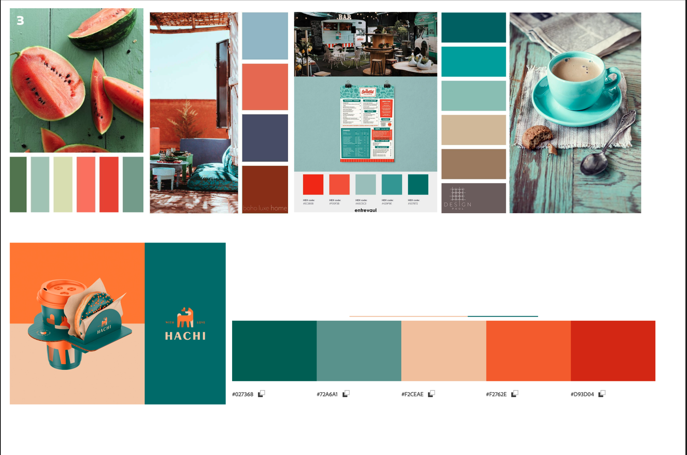

Vista del mesero para tomar la orden del cliente de nuestro primer prototipo de alta fidelidad:

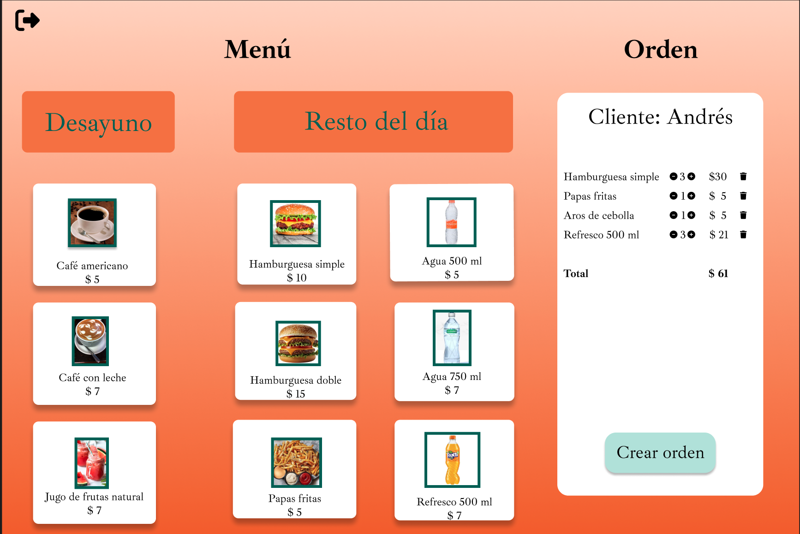

### **Proyecto desplegado**

Vista de ingreso a la aplicación

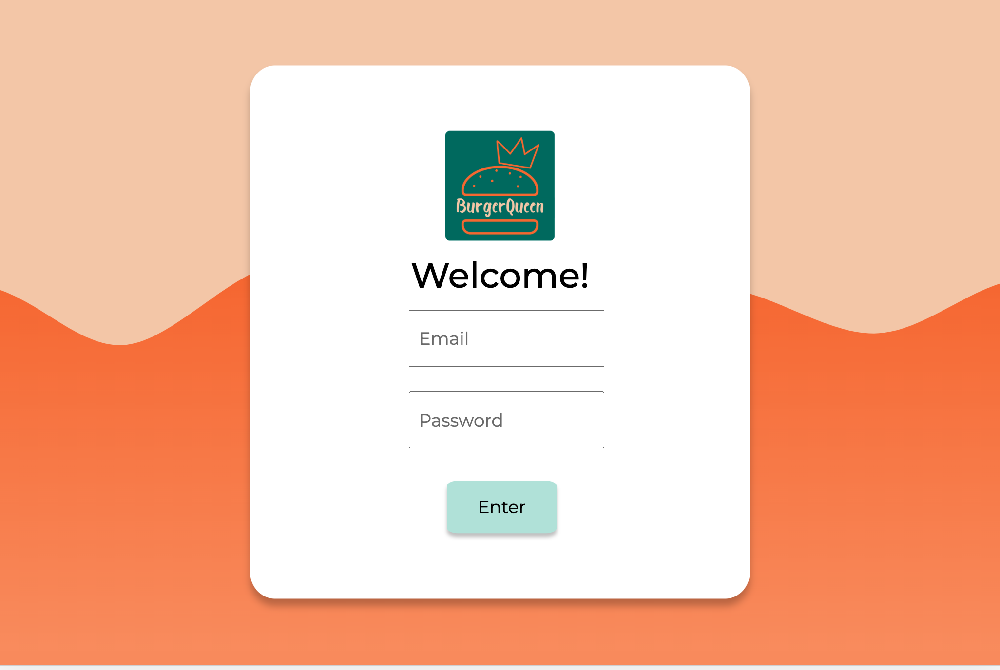

Vista de menú y creación de órdenes Usuario: Mesero

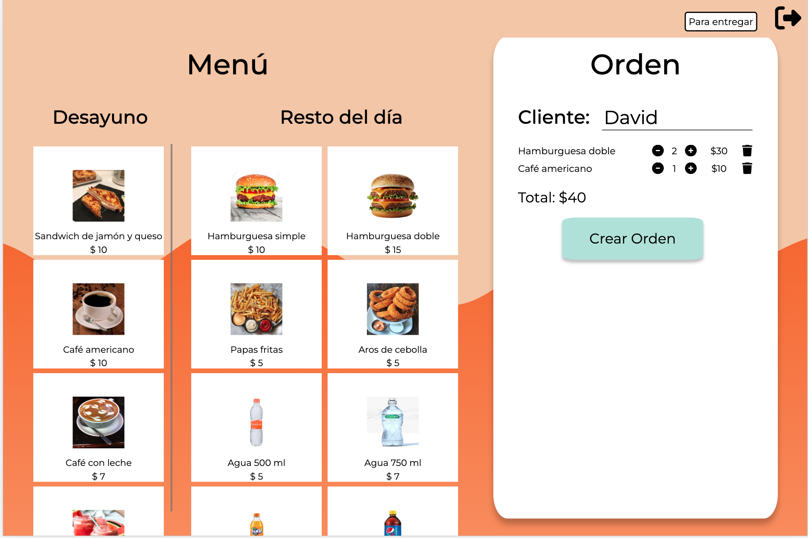

Vista de órdenes q preparar Usuario: Chef

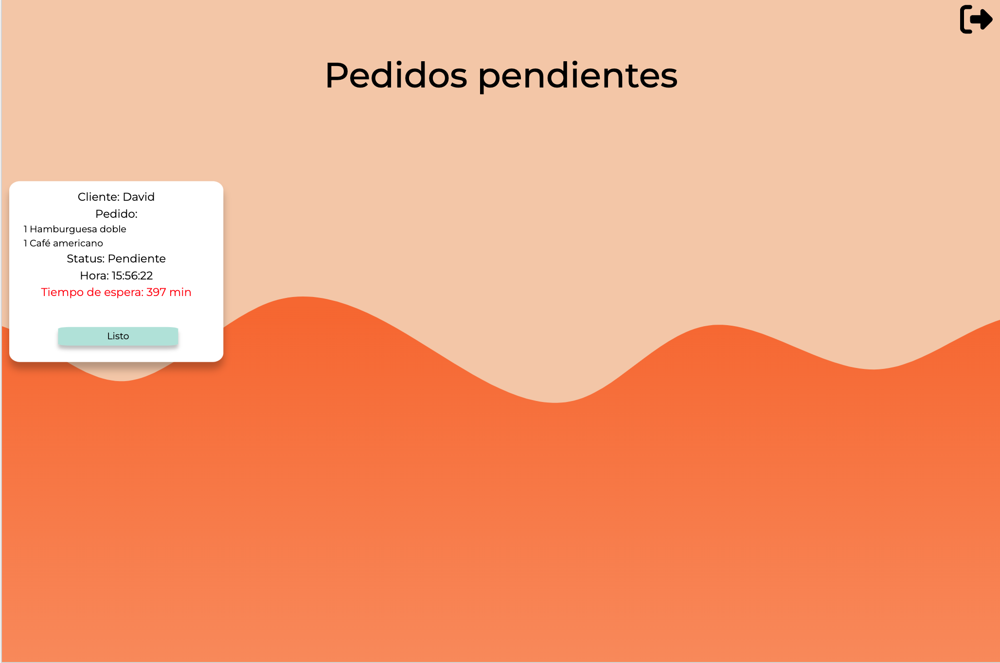

Vista de órdenes listas para entregar a clientes Usuario: Mesero

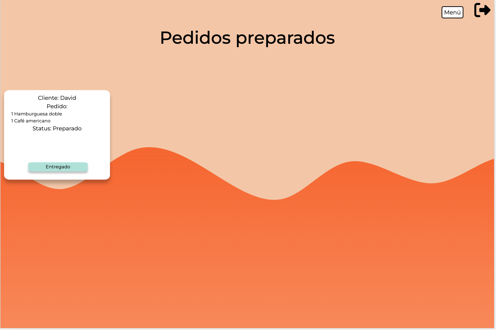

Vista de listado de empleados Usuario: Administrador

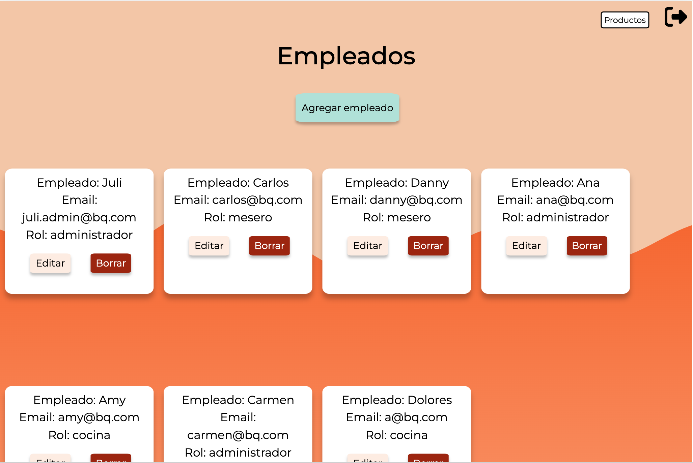

Vista del modal para agregar empleados Usuario: Administrador

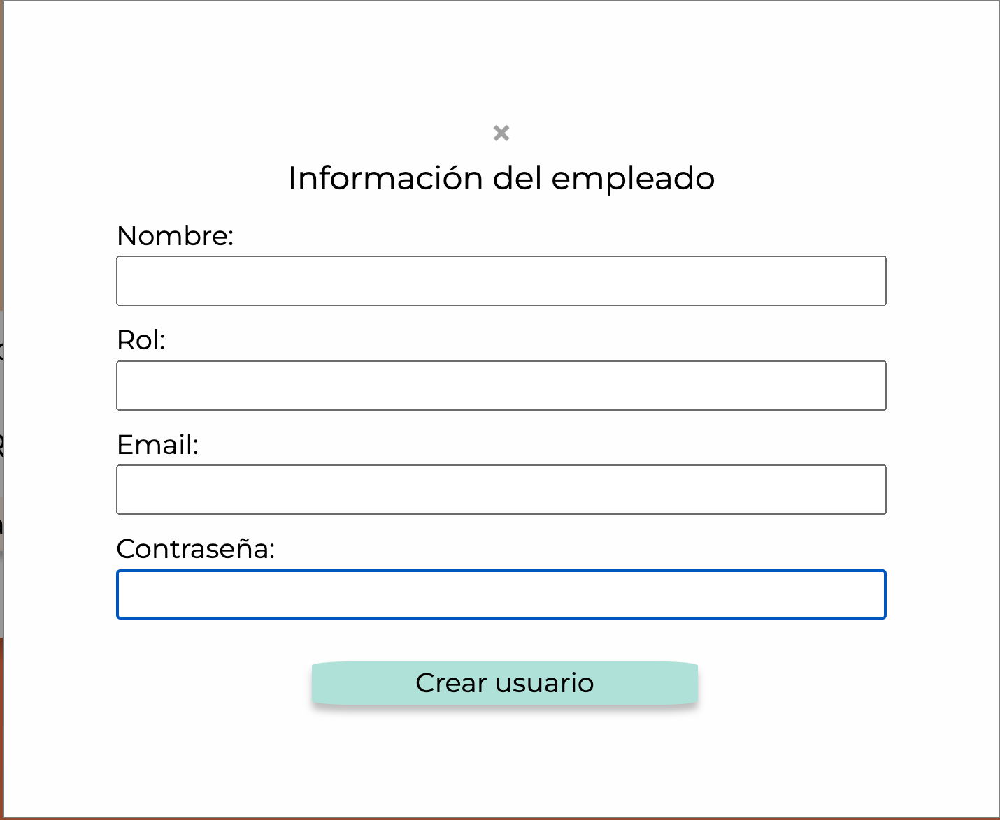

Vista del modal para editar información de los empleados Usuario: Administrador

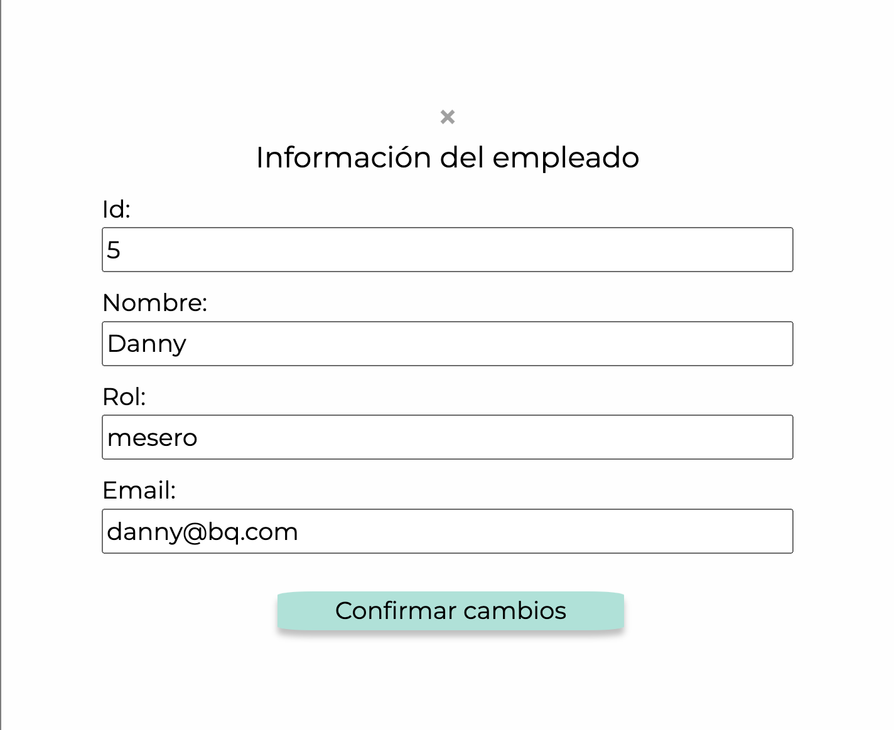

Vista de listado de productos Usuario: Administrador

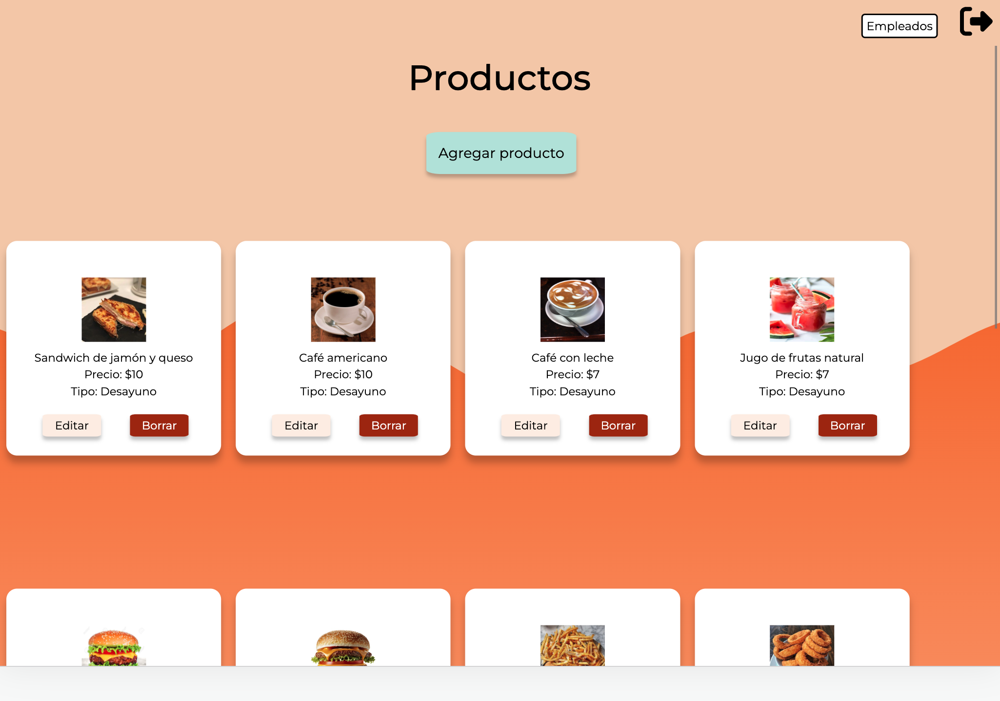

Vista del modal para agregar productos Usuario: Administrador

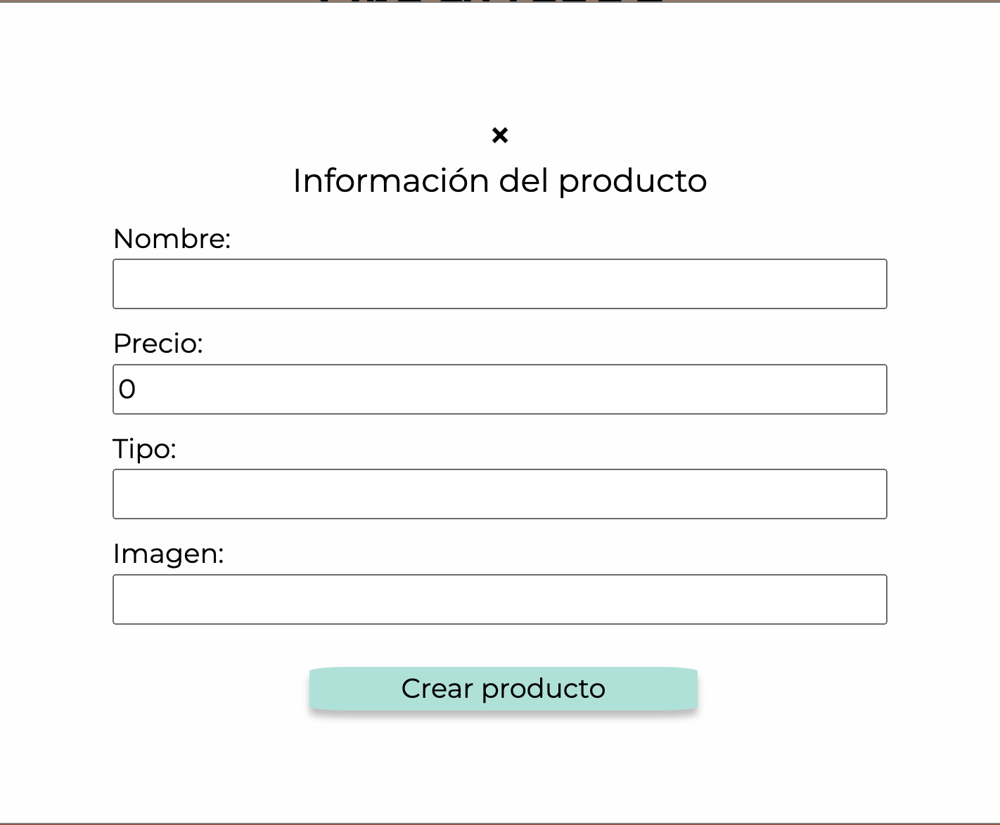

Vista del modal para editar información de los productos Usuario: Administrador

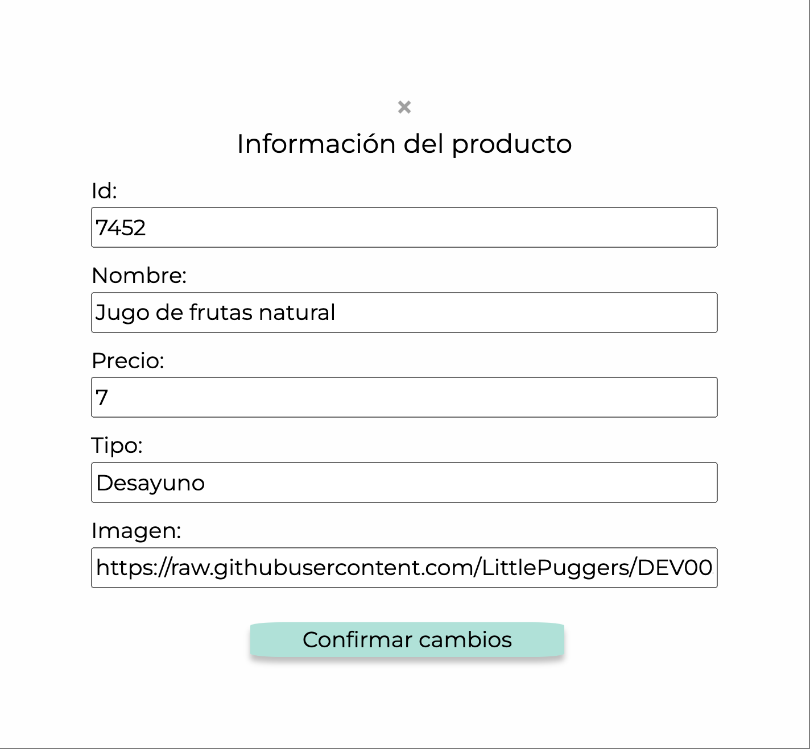
***

## 4 . Tecnologías:

`HTML` `CSS` `Angular` `TypeScript`